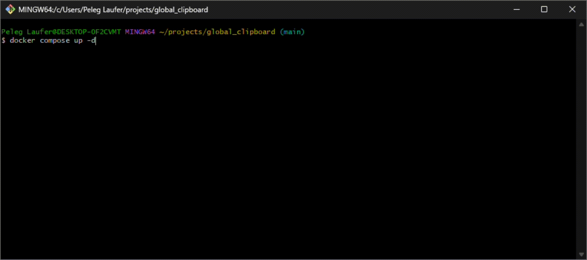

# global_clipboard

**Self-hosted clipboard sync. Copy text or a file on one device, pick it up on any other — no third-party account, no cloud, runs on your own network.**

`Async REST API` · `FastAPI` · `Pydantic v2` · `MongoDB` · `Docker Compose` · `pytest` · `GitHub Actions` · `OpenAPI`

[](https://www.python.org/)
[](https://fastapi.tiangolo.com/)
[](https://www.mongodb.com/)
[](https://docs.docker.com/compose/)
[](LICENSE)
[](https://github.com/peleg-laufer/global_clipboard/actions/workflows/python-app.yml)



<!--
TO RECORD THE DEMO GIF (replaces the line above):
  docker compose down -v
  docker compose up -d
  curl -X POST localhost:8000/text -H "Content-Type: application/json" -d "{\"text\":\"hello from my laptop\"}"
  curl localhost:8000/text
Recorder: ScreenToGif (Windows) or asciinema + agg. Save as docs/demo.gif.
Keep it under ~20s and ~3MB so it loads before the reader scrolls past.
-->

## Quickstart

```bash
git clone https://github.com/peleg-laufer/global_clipboard.git
cd global_clipboard
docker compose up -d
```

That's it — the API and its MongoDB are both up. Round-trip a clipboard entry:

```bash
curl -X POST localhost:8000/text -H "Content-Type: application/json" -d '{"text":"hello from my laptop"}'
curl localhost:8000/text
```

Interactive API docs: **http://localhost:8000/docs**

Uploads and history live in named Docker volumes, so `docker compose down` and back up keeps your data.

## What it does

- **Text sync** — push clipboard text from any device, pull it from any other
- **Undo history** — the last five saves are kept; step back through them one at a time
- **Three file slots** — upload a file to a slot, then download, replace or delete it from anywhere
- **Self-healing startup** — the server reconciles the files directory against the database on boot, so dropping a file into the folder by hand doesn't corrupt state
- **Typed end to end** — Pydantic validates every request and response, and the OpenAPI schema is generated from it

## How it's built

Two layers, strictly separated. `src/clip_api.py` holds route handlers only: validate the slot, call the handler, translate the result into a status code. `src/clip_db_handler.py` holds all the business logic — async Mongo queries, file I/O, the Pydantic models — and knows nothing about HTTP, raising domain exceptions (`IllegalSlotError`, `TakenSlotError`) that the route layer turns into 400/404/409.

- **Async throughout** — async `pymongo` for the database, `aiofiles` for disk
- **Internal vs. public models** — `FileMeta` carries the absolute `file_path`; `PublicFileMeta` omits it, so the on-disk layout never leaks into a response
- **Startup reconciliation** — untracked files get registered, records whose file vanished get dropped, duplicate slot claims get resolved
- **Config from the environment** — `pydantic-settings` with defaults anchored to the repo, so real env vars (how Compose injects the DB URI) override a local `.env`

<details>
<summary><b>API reference</b></summary>

### Text

| Method | Path | Description | Status codes |
|---|---|---|---|
| `GET` | `/text` | Fetch the most recent text save | 200, 204 |
| `POST` | `/text` | Push new text to history (max 512 chars) | 200 |
| `POST` | `/text/undo` | Revert to the previous save | 200, 204 |

### Files

| Method | Path | Description | Status codes |
|---|---|---|---|
| `GET` | `/files` | List all files assigned to slots | 200 |
| `GET` | `/files/pre-existing` | List files found on disk but not assigned to a slot | 200 |
| `GET` | `/files/{slot}` | Get metadata for slot 0, 1, or 2 | 200, 204, 400 |
| `GET` | `/files/{slot}/download` | Download raw file bytes | 200, 400, 404 |
| `POST` | `/files?slot={slot}` | Upload a file to an empty slot | 200, 400, 409 |
| `PUT` | `/files/{slot}/replace` | Replace the file in an occupied slot | 200, 400, 404 |
| `DELETE` | `/files/{slot}` | Delete the file in a slot | 200, 400, 404 |

File metadata response shape:

```json
{
  "file_name": "report.pdf",
  "file_type": "application/pdf",
  "file_size": 204800,
  "file_uuid": "3f2a1b...",
  "file_slot": 0
}
```

Files are stored on disk under their `file_uuid`; the original filename lives only in MongoDB. Files not assigned to a slot are surfaced at `/files/pre-existing`.

</details>

## Running without Docker

Needs Python 3.14 and a MongoDB on `localhost:27017`.

```bash
pip install -r requirements-dev.txt     # runtime deps + pytest, ruff, fastapi-cli
python -m fastapi dev src/clip_api.py   # dev server with reload
```

Copy `.env.example` to `src/.env` to override any setting; every one of them has a working default, so an empty file is fine.

## Tests

```bash
pytest                  # 24 tests against a throwaway database
ruff check src tests
```

Each test gets a clean database and a temp files directory, dropped on teardown. `pytest` needs its own Mongo on `localhost:27017` — the Compose database deliberately publishes no port. Lint and tests also run in GitHub Actions on every push to `main`.

## Notes

Single-user and LAN-only by design — there is no auth, because it is meant to run on a machine you already trust. Built as a self-taught exercise in async Python, REST API design and document databases. The backend here is hand-written; the cross-platform Flutter client, which lives in its own repository, was built with AI assistance so I could spend my own effort on this side.

## License

MIT — see [LICENSE](LICENSE).
